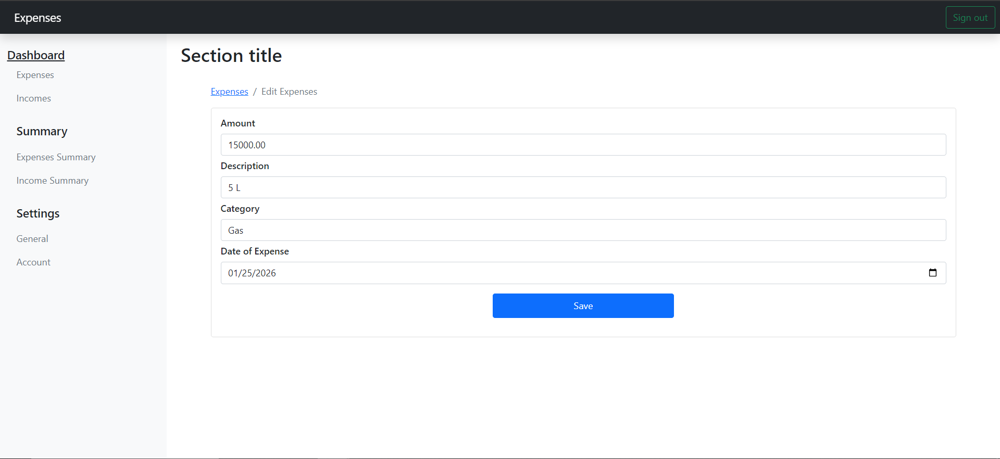
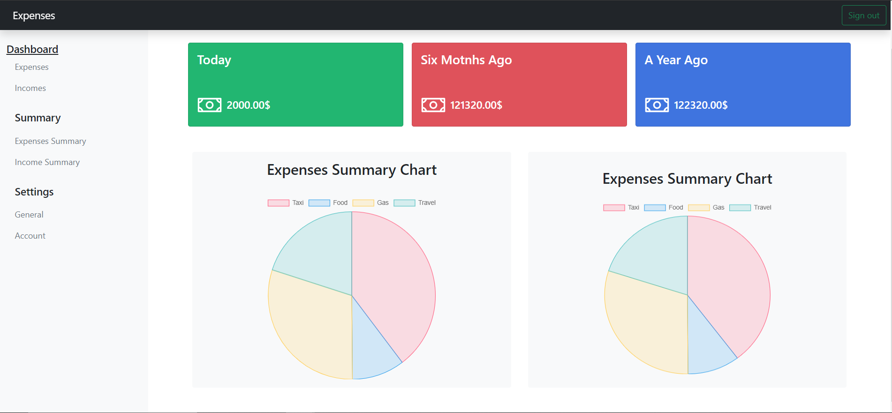
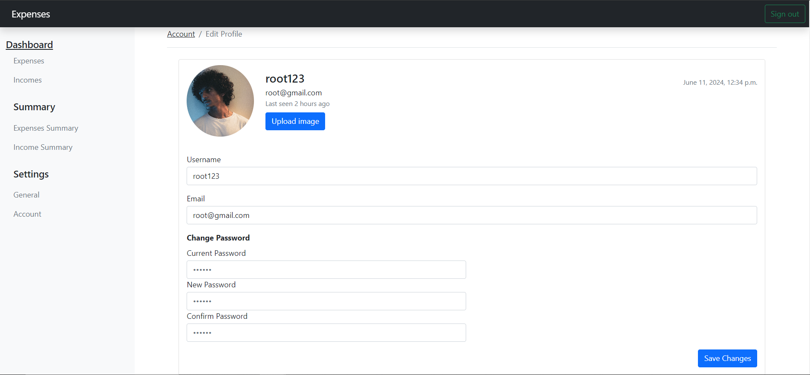

# Django Expenses Project

## Overview
The Django Expenses Project is a web application designed to help users manage their expenses and incomes, track spending, and provide budgeting features. The app also displays diagrams using Chart.js and allows users to update their account information.

## Table of Contents
- [Overview](#overview)
- [Features](#features)
- [Usage](#usage)
- [Screenshots](#screenshots)
- [Technologies](#technologies)
- [Contributing](#contributing)
- [License](#license)

## Features
- **Expense and Income Management:** Users can add, edit, and delete their expenses and incomes.
- **Spending Tracking:** The app tracks spending over time and categorizes expenses for better insights.
- **Visual Diagrams:** The app uses Chart.js to display various diagrams, helping users visualize their financial data.
- **Account Management:** Users can update their username, email, and password.

## Usage
1. Access the application at `http://127.0.0.1:8000/`.
2. Log in with your superuser account.
3. Use the navigation bar to manage expenses, view spending, and update account information.

## Screenshots
### Dashboard

### Edit Expense or Income

### View Summary

### Pereferences

### Account Management

## Technologies
- **Backend:** Python, Django
- **Frontend:** Bootstrap,JavaScript
- **APIs:** RESTful API
- **Charts:** Chart.js

## Contributing
1. Fork the repository.
2. Create a new branch (`git checkout -b feature-branch`).
3. Make your changes.
4. Commit your changes (`git commit -m 'Add new feature'`).
5. Push to the branch (`git push origin feature-branch`).
6. Create a new Pull Request.

## License
This project is licensed under the MIT License. See the [LICENSE](LICENSE) file for more information.
